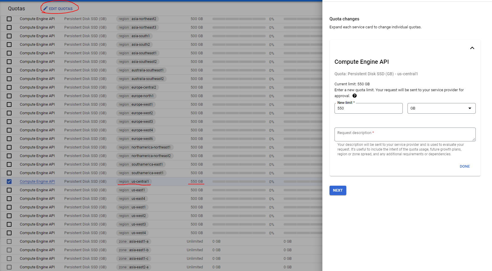

# M13_SparkStreaming_JVM_GCP
1) Create your own project on GCP (currently Google offers trial accounts up to 300$).
2) You won't be able to create even the smallest Databricks cluster because of Google Quotas. Go to IAM & Admin > Quotas. In filter search for "Persistent Disk SSD". Choose **specific region** for your future clusters, like "us-central1" and edit your quota to be higher than 500 (550 Gb should be enough for the smallest cluster). You'll need to give your phone number and description of the request, but usually such requests are approved automatically.
     
   Note: You might have to apply Billing to your GCP account and input your payment information for this step.
3) On GCP in navigation menu go to Marketplace and search for Databricks. As of this moment, Databricks offers up to 14 day trial for new GCP accounts. Subscribe to the service.
4) After the subscription has been approved click on "Manage on provider" button on the Databricks marketplace page and sign in with your credentials.
5) Create Workspace in Databricks. Be sure to choose the region with increased quotas.
6) While your Workspace is loading, install Google Cloud CLI (gcloud & gsutil) and Terraform.
7) Use `gcloud auth login && gcloud auth application-default login && gcloud config set project [PROJECT]` to initialize access to your project.
8) Run `terraform init && terraform apply`. Provide your project ID and already **existing** bucket for Terraform state. Terraform will create an additional bucket, and a service account with RW permissions for this bucket.  
   Note: While creating Databricks cluster don't forget in "Advanced options" to provide created service account to be able to access GCS bucket. Be vary of quotas when creating a cluster. It is possible that you might have to increase additional quotas if you plan on creating cluster, larger than the smallest one.
9) Don't forget to `terraform destroy` your resources, to delete your Workspace and to unsubscribe from Databricks after concluding all tutorials.  
   Note: Each Databricks Workspace requires 3-node K8S clusters, so be sure that your Workspace does not exist when you're not using it, since Google will bill you for the Compute Engine costs **even if Workspace exists idly**.