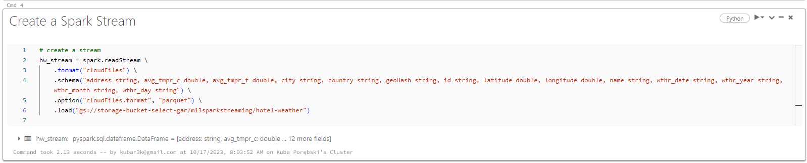

# Spark Streaming homework

## Overview

This homework shows how one can make simple Spark Streaming application in Databricks workspace. 
We have data in Google Cloud Provider bucket and we want to demonstrate how to stream data from the bucket into the delta table located in Databricks.

## Steps

### Running an incremental copy python script
There is a file named `incremental_copy.py` and a simple utility `run_incremental_copy.sh`. You can run this `sh` file, and supply it with a directory where data files are located. 

For example, when you unpack here a zip file containing all data, there will be a directory named `m13sparkstreaming`, and inside it, there will be another directory named `hotel-weather`. So you should put `./m13sparkstreaming` when asked.

Example output using Cygwin:

You can set environment variables used by python script:
* WAIT_TIME - wait time between sending each day folder [seconds], can be floating point number,
* BUCKET_NAME - name of GCP bucket.

### Notebook
Initial steps should be done just like there were described in the `OLD_README.MD` file. 

My full Databricks notebook is located in `notebooks/StreamApp.py` file. Let's open it. Here, I mention important parts:

* Creating the Spark Stream. Following code will create PySpark stream, using _Auto Loader_. This will be achieved using `readStream` method with a `cloudFiles` format. Here we supply the schema, but Spark can also detect and infer schema from the files themselves.

* Variable `hw_stream` is just holding a reference to a stream object. It does not yet create actual streaming operation. For that, we need to specify destination of our stream. We can use `writeStream` with specified options, and `toTable` method which specifies a sink for our streaming operation.
* I also used a thread to specify a time limit for streaming operation. We can execute `hw_stream.stop()` method to stop streaming.

* How to check if there is actually any data retrieved? We can check by executing next cell every few seconds.

* Next cells just are doing task objectives: preparing and showing data. Last cell in the notebook shows actually graphs with results.

